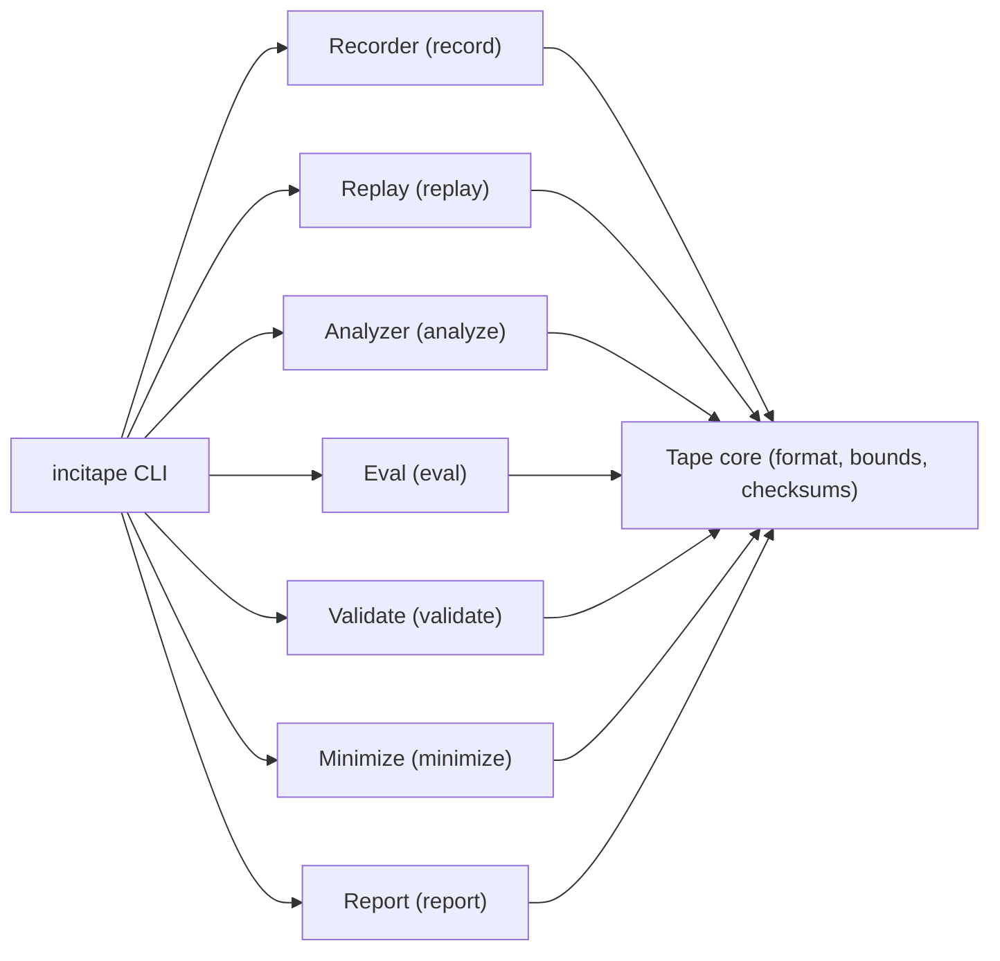

# IncidentTape (`incitape`)

Incidents as **replayable telemetry tapes**: record OTLP, replay on demand, run deterministic RCA, and enforce regression gates.


## What it does

`incitape` is a CLI that turns an incident into a portable artifact (`tape_dir/`) you can:
- **Record** from OTLP (gRPC + HTTP) with redaction-on-ingest.
- **Replay** deterministically to an OTLP gRPC endpoint.
- **Analyze** traces-first and write deterministic `analysis.json`.
- **Report** a deterministic `report.md` (optional, schema-validated local AI enhancement).
- **Validate** tapes and derived outputs (strict mode includes leakage scanning).
- **Minimize** a tape for safe sharing while preserving RCA behavior.
- **Eval** on deterministic suites and enforce gates (leakage=0, never-regress).

## Why

Production incidents are hard to reproduce and easy to regress.

IncidentTape makes incidents:
- **Reproducible**: capture what happened once, replay forever.
- **Shareable**: minimize + redact, then ship a tape to teammates/CI.
- **Gated**: run eval suites in CI so analyzer quality and safety don't silently degrade.

## Architecture (high level)



### The artifact: `tape_dir/`

A finalized tape directory contains:

```
<tape_dir>/
  manifest.yaml
  tape.tape.zst
  checksums.sha256
  analysis.json   # optional (analyze output)
  report.md       # optional (report output)
  eval.json       # optional (eval output)
```

- `tape_id := sha256(bytes of tape.tape.zst)` (stable identity for the captured incident).
- Records are processed in a canonical order so replay/analyze are deterministic.

### Code layout

Core crates (one per major component boundary):

| Crate | Responsibility |
|---|---|
| `incitape-cli` | CLI entrypoint (binary is `incitape`) |
| `incitape-core` | Error model, config, canonical JSON helpers |
| `incitape-tape` | Tape format, bounds, checksums, tape_id |
| `incitape-redaction` | Redaction ruleset + entropy detector + OTLP string redaction |
| `incitape-recorder` | OTLP receivers (gRPC/HTTP), auth/TLS enforcement, redaction-on-ingest, atomic finalize |
| `incitape-replay` | Deterministic replay, speed control, filtering, OTLP exporter |
| `incitape-analyzer` | Traces-first RCA + deterministic ranking (`analysis.json`) |
| `incitape-eval` | Deterministic suite generator + scoring + regression gates (`eval.json`) |
| `incitape-report` | Deterministic `report.md`; optional schema-validated local AI enhancement |
| `incitape-minimize` | Produce smaller/safer derived tapes while preserving RCA behavior |

## Quickstart (from source)

Prereqs: Rust (stable).

Build:
```bash
cargo build --locked --release
```

Run the CLI:
```bash
# Linux/macOS
./target/release/incitape --help

# Windows (PowerShell)
.\target\release\incitape.exe --help
```

For development (no release build):
```bash
cargo run --locked -p incitape-cli -- --help
```

## Common workflows

### 1) Record -> Analyze -> Report (local)

```bash
incitape record --out ./tapes/demo --duration 10
incitape analyze ./tapes/demo --overwrite
incitape report ./tapes/demo --overwrite
```

### 2) Replay a tape to an OTLP collector

```bash
incitape replay ./tapes/demo --to http://127.0.0.1:4317 --speed 0
```

### 3) Validate (strict)

```bash
incitape validate ./tapes/demo --strict
```

### 4) Run evaluation suites (regression gates)

Generate deterministic tapes and run eval:
```bash
incitape eval generate --suite eval/suites/synthetic-smoke.yaml --out eval_out/smoke --overwrite
incitape eval run --suite eval/suites/synthetic-smoke.yaml --out eval_out/eval.json --overwrite
```

Leakage suite (must be zero):
```bash
incitape eval generate --suite eval/suites/secret-injection.yaml --out eval_out/secret --overwrite
incitape eval run --suite eval/suites/secret-injection.yaml --out eval_out/secret_eval.json --overwrite
```

### 5) Minimize a tape for sharing

```bash
incitape minimize ./tapes/demo --out ./tapes/demo-min --drop-logs-metrics --overwrite
incitape validate ./tapes/demo-min --strict
```

## Configuration

`incitape` uses a YAML config file for recorder network policy (and optional AI report mode):

```yaml
recorder:
  grpc_bind: "127.0.0.1:4317"
  http_bind: "127.0.0.1:4318"
  tls:
    enabled: false
    cert_path: null
    key_path: null
  auth:
    enabled: false
    token_path: null
ai:
  enabled: false
  endpoint: null
  timeout_secs: 10
```

Run with config:
```bash
incitape --config ./config.yaml record --out ./tapes/demo --duration 10
incitape --config ./config.yaml report ./tapes/demo --overwrite
```

Security note: if you bind the recorder to a non-loopback address, it will refuse to start unless **TLS and bearer auth** are enabled and configured.

## AI report mode (optional)

AI is **report-only**: it never changes `analysis.json` or the ranking; it can only add an extra section to `report.md`.

Requirements:
- Enable AI in config and set a loopback-only endpoint (local Ollama).
- Pass `--ai` to `incitape report`.

Example config:
```yaml
ai:
  enabled: true
  endpoint: "http://127.0.0.1:11434"
  timeout_secs: 10
```

Run report with AI:
```bash
incitape --config ./config.yaml report ./tapes/demo --ai --overwrite
```

Safety behavior:
- Endpoint must be loopback-only (`http://127.0.0.1` or `http://[::1]`), otherwise `report` fails with a security refusal (exit code 4).
- AI output is schema-validated; if it fails validation, `incitape` falls back to the deterministic report.
- Use `--ai-strict` to treat any AI failure as an error (useful in CI).
- Use `--ai-deterministic` for best-effort deterministic provider settings (temperature=0, etc.).

## Determinism + safety (non-negotiable)

- **Offline-first**: `analyze`, `eval`, `validate`, and `minimize` are designed to run without any network calls.
- **Fail-closed**: corrupt/oversized/malformed tapes are rejected (no partial "best effort" parsing).
- **Deterministic outputs**: `analysis.json` and `eval.json` are written with canonical JSON rules and stable ordering.
- **Leakage gate**: strict validation and the secret-injection suite enforce leakage_count == 0.

## Exit codes

`incitape` is CI-friendly and uses stable, meaningful exit codes:

| Code | Meaning |
|---:|---|
| 0 | success |
| 2 | usage error (bad flags/args) |
| 3 | validation error (corrupt/invalid inputs) |
| 4 | security refusal (unsafe config / forbidden operation) |
| 5 | internal error (bug) |

## Demo

One-command end-to-end demo (Docker required):
```bash
./demo/run_demo.sh
```

## Development + gates

See:
- `RELEASE_CHECKLIST.md` (acceptance run commands)
- `SECURITY_REVIEW.md` (critical-flow review + evidence)

## License

Apache-2.0 (see workspace `Cargo.toml`).
