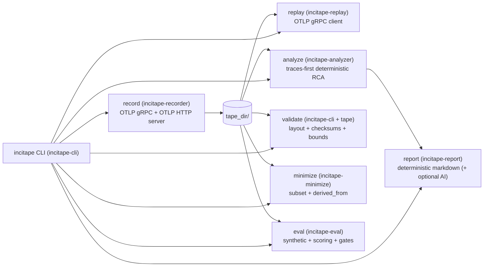
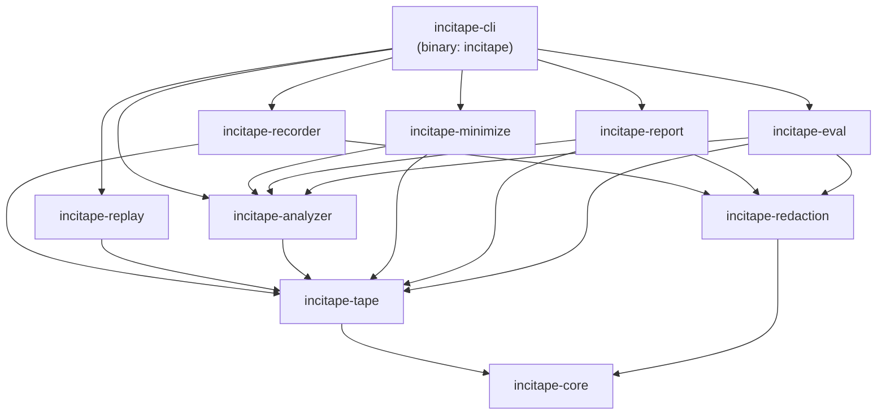
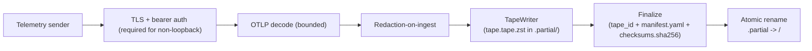
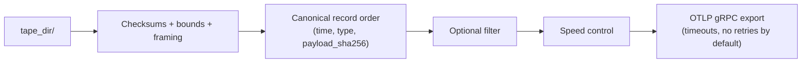
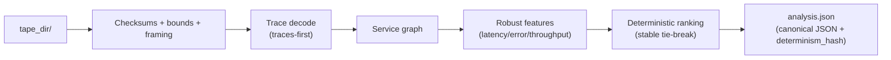
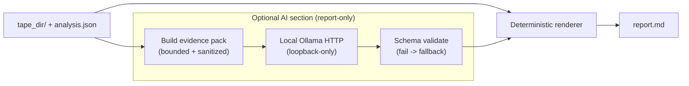
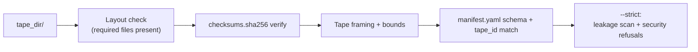
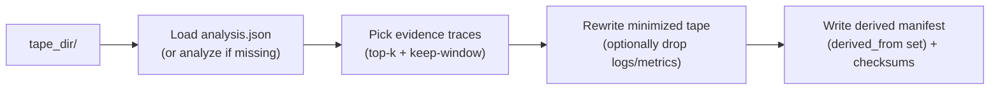
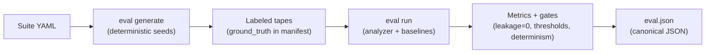

# IncidentTape (`incitape`)

Reproducible incidents as replayable telemetry tapes.

`incitape` is a CLI that records OpenTelemetry telemetry (OTLP) into a deterministic on-disk artifact, then lets you replay, analyze, report, minimize, validate, and evaluate it. The design goals are **offline-first**, **fail-closed**, and **CI-friendly determinism**.

## Why this exists

Incidents are expensive to debug because they're hard to reproduce, and RCA tooling is easy to regress quietly.

IncidentTape makes incidents:
- **Reproducible**: capture once, replay forever.
- **Shareable**: minimize + redact, then ship a tape to teammates or CI.
- **Gated**: deterministic eval suites (including leakage=0) prevent silent safety/quality regression.

## What you get

- **Recorder** (`incitape record`): OTLP gRPC + OTLP HTTP ingest, redaction-on-ingest, atomic finalize.
- **Tape format**: a stable `tape_id` + checksums + strict bounds; hostile inputs are rejected.
- **Replay** (`incitape replay`): deterministic record order with speed control and filtering.
- **Analyzer** (`incitape analyze`): traces-first deterministic RCA -> `analysis.json`.
- **Report** (`incitape report`): deterministic `report.md` (optional local AI enhancement, schema-validated with fallback).
- **Validate** (`incitape validate`): verifies layout, checksums, framing, ids, and strict leakage scanning.
- **Minimize** (`incitape minimize`): create a smaller/safer derived tape that preserves RCA behavior.
- **Eval** (`incitape eval generate/run`): deterministic suites + regression gates (including leakage=0).

## Tape artifact (`tape_dir/`)

A finalized tape directory contains:

```
<tape_dir>/
  manifest.yaml
  tape.tape.zst
  checksums.sha256
  analysis.json   # optional (analyze output)
  report.md       # optional (report output)
  eval.json       # optional (eval output)
```

- `tape_id := sha256(bytes of tape.tape.zst)` is the stable identity.
- Derived outputs (`analysis.json`, `report.md`, `eval.json`) MUST NOT affect `tape_id`.

## Quickstart (from source)

Prereqs: Rust (stable).

Build a release binary:
```bash
cargo build --locked --release
```

Run it:
```bash
# Linux/macOS
./target/release/incitape --help

# Windows (PowerShell)
.\target\release\incitape.exe --help
```

Dev workflow (no release build):
```bash
cargo run --locked -p incitape-cli -- --help
```

Optional: install from the local workspace:
```bash
cargo install --locked --path crates/incitape-cli
```

## Common workflows

### Record -> Analyze -> Report

```bash
incitape record --out ./tapes/demo --duration 10
incitape analyze ./tapes/demo --overwrite
incitape report ./tapes/demo --overwrite
```

### Replay a tape

```bash
incitape replay ./tapes/demo --to http://127.0.0.1:4317 --speed 0
```

### Validate (strict)

```bash
incitape validate ./tapes/demo --strict
```

### Run evaluation suites (regression gates)

```bash
incitape eval generate --suite eval/suites/synthetic-smoke.yaml --out eval_out/smoke --overwrite
incitape eval run --suite eval/suites/synthetic-smoke.yaml --out eval_out/eval.json --overwrite
```

Leakage suite (must be zero):
```bash
incitape eval generate --suite eval/suites/secret-injection.yaml --out eval_out/secret --overwrite
incitape eval run --suite eval/suites/secret-injection.yaml --out eval_out/secret_eval.json --overwrite
```

### Minimize a tape for sharing

```bash
incitape minimize ./tapes/demo --out ./tapes/demo-min --drop-logs-metrics --overwrite
incitape validate ./tapes/demo-min --strict
```

## Configuration

`incitape` reads configuration from a YAML file via `--config <path>`.

Safe-by-default example:
```yaml
recorder:
  grpc_bind: "127.0.0.1:4317"
  http_bind: "127.0.0.1:4318"
  tls:
    enabled: false
    cert_path: null
    key_path: null
  auth:
    enabled: false
    token_path: null
ai:
  enabled: false
  endpoint: null
  timeout_secs: 10
```

Run with config:
```bash
incitape --config ./config.yaml record --out ./tapes/demo --duration 10
```

### Network exposure (fail-closed)

If you configure recorder binds to a non-loopback address, `incitape record` refuses to start unless **TLS and bearer auth** are enabled.

Example (non-loopback):
```yaml
recorder:
  grpc_bind: "0.0.0.0:4317"
  http_bind: "0.0.0.0:4318"
  tls:
    enabled: true
    cert_path: "./server.crt"
    key_path: "./server.key"
  auth:
    enabled: true
    token_path: "./bearer_token.txt"
```

## AI report mode (optional)

AI is **report-only**: it never changes `analysis.json` or the ranking; it can only add an extra section to `report.md`.

Enable AI in config (local Ollama) and run `report` with `--ai`:
```yaml
ai:
  enabled: true
  endpoint: "http://127.0.0.1:11434"
  timeout_secs: 10
```

```bash
incitape --config ./config.yaml report ./tapes/demo --ai --overwrite
```

Safety behavior:
- Endpoint must be loopback-only (`http://127.0.0.1` or `http://[::1]`) or `report` fails with exit code 4.
- AI output is schema-validated; invalid output triggers a deterministic fallback report.
- `--ai-strict` makes AI failures fatal (useful for CI).
- `--ai-deterministic` enables best-effort deterministic provider settings.

## Determinism + safety (non-negotiable)

- **Offline-first**: `analyze`, `eval`, `validate`, and `minimize` are designed to run without any network calls.
- **Fail-closed**: corrupt/oversized/malformed tapes are rejected (no partial parsing).
- **Deterministic outputs**: `analysis.json` and `eval.json` are written with canonical JSON rules and stable ordering.
- **Leakage gate**: strict validation and the secret-injection suite enforce leakage_count == 0.

## Exit codes

| Code | Meaning |
|---:|---|
| 0 | success |
| 2 | usage error (bad flags/args) |
| 3 | validation error (corrupt/invalid inputs) |
| 4 | security refusal (unsafe config / forbidden operation) |
| 5 | internal error (bug) |

## Architecture (detailed)

`incitape` is a Rust workspace split by component boundaries. The CLI is intentionally thin; most behavior lives in component crates that depend on the tape/core layer.



### Dependency layers

The intended dependency direction is "downwards" (high-level components depend on tape/core, never the other way around):



### Record pipeline (networked)



Fail-closed highlights:
- Non-loopback bind without TLS+auth -> refuse to start (exit code 4).
- Oversized inputs / bounds violations / decode errors -> reject (no partial writes).
- Redaction failure -> abort (exit code 5).

### Replay pipeline (networked)



### Analyze pipeline (offline-first)



### Report pipeline (offline-first, optional local AI)



### Validate pipeline (offline-first)



### Minimize pipeline (offline-first)



### Eval pipeline (offline-first)



### Code layout

| Crate | Responsibility |
|---|---|
| `incitape-cli` | CLI entrypoint (binary is `incitape`) |
| `incitape-core` | Error model, config, canonical JSON helpers |
| `incitape-tape` | Tape format, bounds, checksums, tape_id |
| `incitape-redaction` | Redaction ruleset + entropy detector + OTLP redaction |
| `incitape-recorder` | OTLP servers (gRPC/HTTP), auth/TLS enforcement, redaction-on-ingest, atomic finalize |
| `incitape-replay` | Deterministic replay + exporter |
| `incitape-analyzer` | Traces-first deterministic RCA |
| `incitape-eval` | Suite generator + scorer + regression gates |
| `incitape-report` | Deterministic report + optional schema-validated local AI |
| `incitape-minimize` | Produce smaller derived tapes |

## Demo

One-command end-to-end demo (Docker required):
```bash
./demo/run_demo.sh
```

## Development + gates

See:
- `RELEASE_CHECKLIST.md` (acceptance run commands)
- `SECURITY_REVIEW.md` (critical-flow review + evidence)

## License

Apache-2.0 (see workspace `Cargo.toml`).
