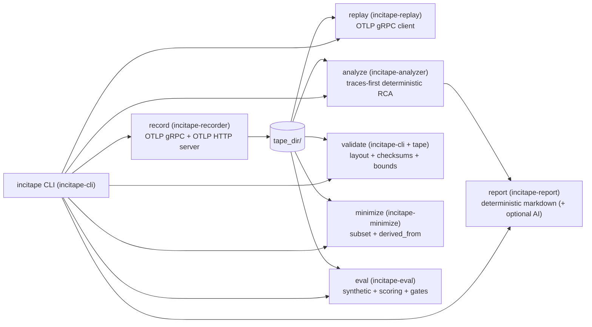
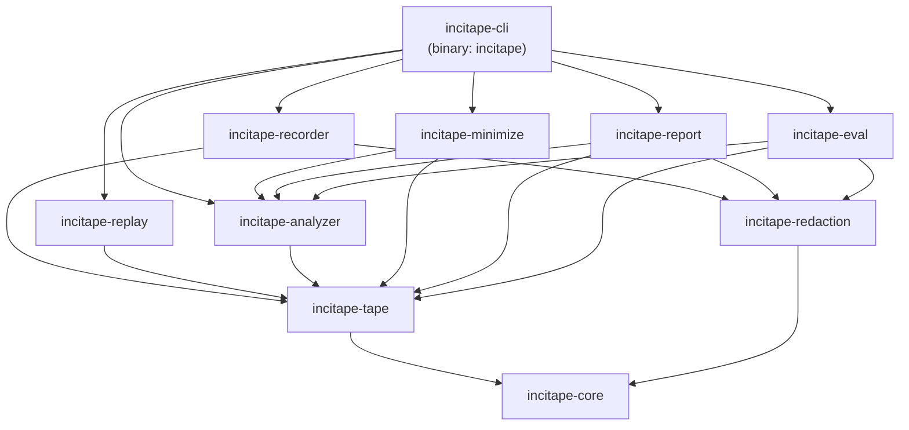
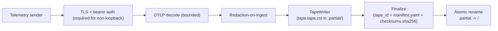
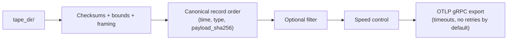
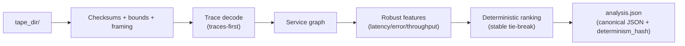
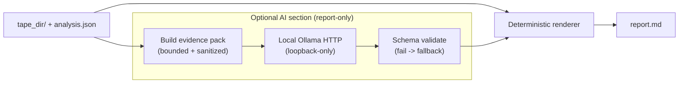
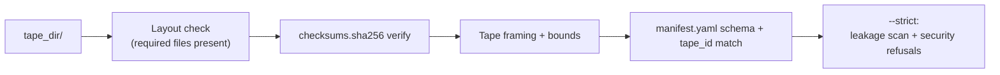
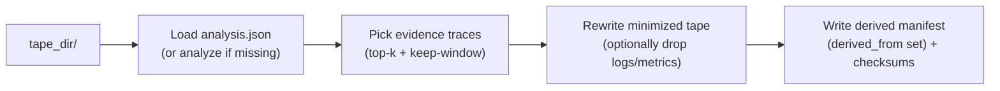
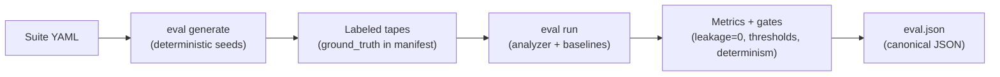

# Architecture (detailed)

This document is the detailed architecture reference for IncidentTape (`incitape`).

If you only want a quick orientation, see `../README.md` (Architecture overview).

## Overview diagram

## Dependency layers

The intended dependency direction is "downwards" (high-level components depend on tape/core, never the other way around):

## Pipelines

### Record pipeline (networked)

Fail-closed highlights:
- Non-loopback bind without TLS+auth -> refuse to start (exit code 4).
- Oversized inputs / bounds violations / decode errors -> reject (no partial writes).
- Redaction failure -> abort (exit code 5).

### Replay pipeline (networked)

### Analyze pipeline (offline-first)

### Report pipeline (offline-first, optional local AI)

### Validate pipeline (offline-first)

### Minimize pipeline (offline-first)

### Eval pipeline (offline-first)

## Crate map

| Crate | Responsibility |
|---|---|
| `incitape-cli` | CLI entrypoint (binary is `incitape`) |
| `incitape-core` | Error model, config, canonical JSON helpers |
| `incitape-tape` | Tape format, bounds, checksums, tape_id |
| `incitape-redaction` | Redaction ruleset + entropy detector + OTLP redaction |
| `incitape-recorder` | OTLP servers (gRPC/HTTP), auth/TLS enforcement, redaction-on-ingest, atomic finalize |
| `incitape-replay` | Deterministic replay + exporter |
| `incitape-analyzer` | Traces-first deterministic RCA |
| `incitape-eval` | Suite generator + scorer + regression gates |
| `incitape-report` | Deterministic report + optional schema-validated local AI |
| `incitape-minimize` | Produce smaller derived tapes |

## Related docs

- Release checklist: `../RELEASE_CHECKLIST.md`
- Security review: `../SECURITY_REVIEW.md`
